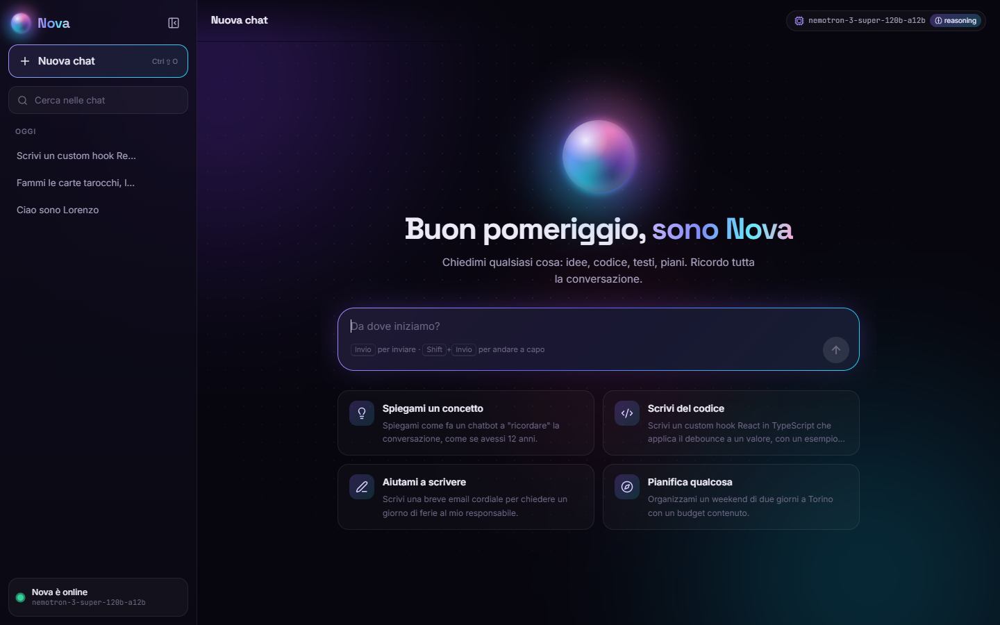
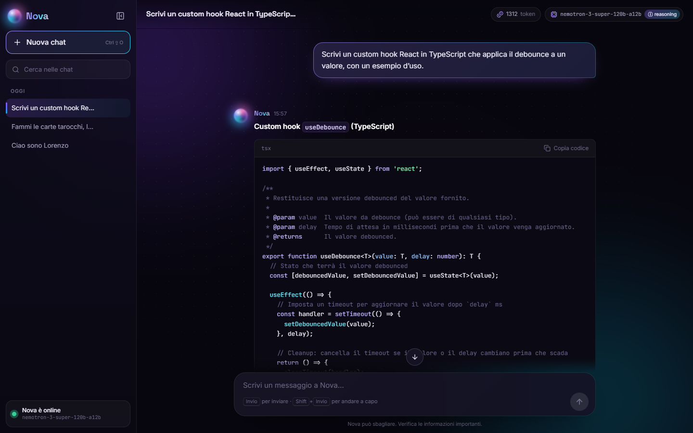
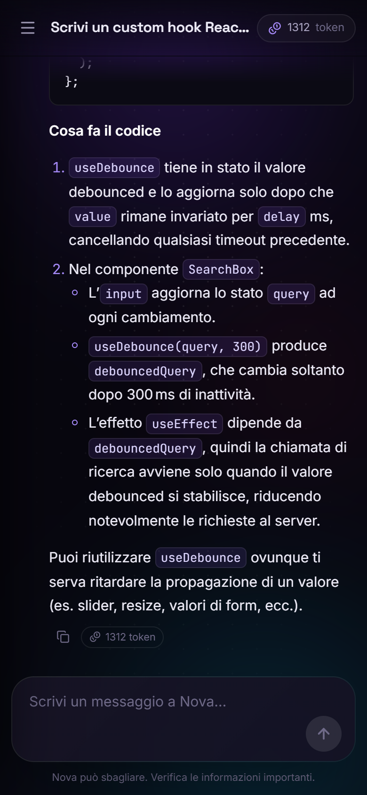
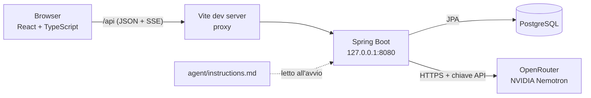

# Nova — clone essenziale di ChatGPT

Applicazione full stack per conversare con un agente AI: più chat salvate, risposte in streaming, cronologia inviata al modello a ogni richiesta e conteggio dei token consumati.
Il frontend è in **React + TypeScript**, il backend in **Spring Boot**, i dati in **PostgreSQL**; il modello linguistico è un modello **NVIDIA Nemotron** gratuito raggiunto tramite **OpenRouter**.



<table>
  <tr>
    <td width="68%"></td>
    <td width="32%"></td>
  </tr>
</table>

---

## Indice

- [Funzionalità](#funzionalità)
- [Requisiti dell'esercizio](#requisiti-dellesercizio)
- [Architettura](#architettura)
- [Tecnologie](#tecnologie)
- [Struttura del progetto](#struttura-del-progetto)
- [Installazione e avvio](#installazione-e-avvio)
- [Configurazione](#configurazione)
- [API REST](#api-rest)
- [Come funziona](#come-funziona)
- [Sicurezza](#sicurezza)
- [Test](#test)

---

## Funzionalità

**Conversazioni**
- Crea, apri, rinomina ed elimina chat; elenco raggruppato per data (Oggi, Ieri, Ultimi 7 giorni…) con ricerca per titolo.
- Titolo generato automaticamente dal primo messaggio.
- Messaggi dell'utente e risposte dell'agente salvati nel database: la chat resta disponibile dopo la chiusura e la riapertura.

**Risposte dell'agente**
- Streaming in tempo reale (Server-Sent Events) con indicatore "Nova sta pensando" e cursore animato.
- Pulsante **Stop** per interrompere la risposta.
- Rendering Markdown: titoli, liste, tabelle, link e blocchi di codice con evidenziazione della sintassi e pulsante **Copia codice**.
- **Rigenera / Riprova** quando un messaggio è rimasto senza risposta.

**Affidabilità**
- Nuovi tentativi automatici quando il modello gratuito è sovraccarico, poi passaggio a un modello di riserva; lo stato ("nuovo tentativo tra poco…") è visibile nella chat.
- Messaggi di errore comprensibili (chiave mancante, limite di richieste, servizio non disponibile, backend spento).
- L'applicazione parte anche senza chiave API: mostra un avviso e continua a permettere la consultazione delle chat.

**Interfaccia**
- Tema scuro con sfondo animato, layout responsive con menu laterale a scomparsa su mobile.
- Token consumati mostrati per ogni risposta e in totale per conversazione; modello in uso visibile nell'intestazione.
- Scorciatoie: <kbd>Invio</kbd> invia, <kbd>Shift</kbd>+<kbd>Invio</kbd> va a capo, <kbd>Ctrl</kbd>+<kbd>Shift</kbd>+<kbd>O</kbd> nuova chat.

---

## Requisiti dell'esercizio

| Requisito | Come è realizzato |
|---|---|
| Creare e gestire più conversazioni, vedere l'elenco e il filo completo dei messaggi | Entità `Conversation` e `Message`, API `/api/conversations`, barra laterale e vista chat nel frontend |
| Le richieste passano dal backend, che custodisce la chiave, prepara il contenuto e restituisce errori comprensibili | Il browser chiama solo `/api`; `OpenRouterClient` aggiunge la chiave lato server; `LlmException` e `GlobalExceptionHandler` traducono gli errori in italiano |
| Comportamento dell'agente definito in un file di istruzioni caricato all'avvio | `BE/src/main/resources/agent/instructions.md`, letto da `AgentInstructions` all'avvio (l'app non parte se il file manca o è vuoto) |
| Il servizio non ha memoria: a ogni richiesta va inviato il contesto | `ContextBuilder` invia prompt di sistema + cronologia + nuovo messaggio |
| Limitare il contesto quando la conversazione è lunga | Strategia "ultimi N messaggi", configurabile con `chat.history.max-messages` (default 20) |
| Registrare i token consumati per ogni chiamata | Entità `TokenUsage`: una riga per chiamata con modello, token di prompt, di risposta e totali |
| Salvare messaggio dell'utente e risposta dell'agente | Entrambi persistiti in PostgreSQL e ricaricati alla riapertura della chat |

---

## Architettura



Il browser non comunica mai direttamente con OpenRouter e non riceve mai la chiave: tutte le chiamate al modello partono dal backend.

---

## Tecnologie

| Livello | Tecnologie |
|---|---|
| Frontend | React 19, TypeScript 6, Vite 8, React Router, react-markdown + remark-gfm + rehype-highlight, lucide-react, CSS puro |
| Backend | Java 25, Spring Boot 4.1 (Web MVC, Data JPA, Validation), Lombok, `java.net.http.HttpClient`, Jackson 3 |
| Database | PostgreSQL |
| AI | OpenRouter (API compatibile OpenAI), modello `nvidia/nemotron-3-super-120b-a12b:free` con reasoning attivo |

---

## Struttura del progetto

```
.
├── start.cmd                 # avvia backend + frontend e apre il browser
├── start-be.cmd              # avvia solo il backend
├── start-fe.cmd              # avvia solo il frontend
├── docs/screenshots/
├── BE/                       # Spring Boot
│   ├── env.properties.example
│   └── src/main/
│       ├── java/com/example/demo/
│       │   ├── agent/        # caricamento del file di istruzioni
│       │   ├── config/       # proprietà OpenRouter e chat, CORS
│       │   ├── controllers/  # API REST e streaming SSE
│       │   ├── entities/     # Conversation, Message, TokenUsage
│       │   ├── exceptions/   # gestione centralizzata degli errori
│       │   ├── llm/          # client OpenRouter, tentativi e modelli di riserva
│       │   ├── payloads/     # DTO
│       │   ├── repositories/
│       │   └── services/     # ChatService, ConversationService, ContextBuilder
│       └── resources/
│           ├── application.properties
│           └── agent/instructions.md
└── FE/                       # React + Vite
    └── src/
        ├── api/              # client HTTP e lettore dello stream SSE
        ├── components/       # Sidebar, Composer, MessageItem, Markdown…
        ├── context/          # stato condiviso: conversazioni, notifiche, layout
        ├── hooks/useChat.ts  # logica di invio, streaming, stop e rigenera
        └── pages/            # nuova chat e conversazione
```

---

## Installazione e avvio

### Prerequisiti

- **Java 25** (JDK)
- **Node.js 20.19+ o 22.12+** e npm
- **PostgreSQL** in esecuzione
- Una chiave API gratuita di **[OpenRouter](https://openrouter.ai/)**

Maven non va installato: il progetto usa il Maven Wrapper (`mvnw`).

### 1. Database

Crea un database vuoto (le tabelle vengono generate automaticamente all'avvio):

```sql
CREATE DATABASE "U5W6D3";
```

### 2. Impostazioni locali del backend

Copia il file di esempio e inserisci la password del database:

```powershell
copy BE\env.properties.example BE\env.properties
```

```properties
DB_URL=jdbc:postgresql://localhost:5432/U5W6D3
DB_USERNAME=postgres
DB_PASSWORD=la-tua-password
OPENROUTER_MODEL=nvidia/nemotron-3-super-120b-a12b:free
```

`env.properties` è escluso da git.

### 3. Chiave OpenRouter

La chiave **non va scritta in nessun file del progetto**: salvala come variabile d'ambiente dell'utente Windows (una sola volta).

```powershell
[Environment]::SetEnvironmentVariable('OPENROUTER_API_KEY', '<la-tua-chiave>', 'User')
```

Su macOS/Linux: `export OPENROUTER_API_KEY=<la-tua-chiave>` nel profilo della shell.

### 4. Avvio

**Windows, con un doppio clic:** `start.cmd`
Apre due finestre (backend e frontend), aspetta che siano pronti e apre http://localhost:5173.
Lo script legge la chiave dal registro di Windows, quindi funziona anche senza riavviare il terminale dopo averla impostata.

**Manualmente**, in due terminali:

```bash
# backend → http://127.0.0.1:8080
cd BE
./mvnw spring-boot:run        # Windows: .\mvnw.cmd spring-boot:run

# frontend → http://localhost:5173
cd FE
npm install
npm run dev
```

---

## Configurazione

Le proprietà si trovano in `BE/src/main/resources/application.properties` e possono essere sovrascritte con variabili d'ambiente o con `BE/env.properties`.

| Proprietà | Default | Descrizione |
|---|---|---|
| `openrouter.model` | da `OPENROUTER_MODEL` | Modello principale |
| `openrouter.fallback-models` | `nvidia/nemotron-3-ultra-550b-a55b:free` | Modelli di riserva, separati da virgola (variabile `OPENROUTER_FALLBACK_MODELS`) |
| `openrouter.max-retries` | `2` | Tentativi extra sullo stesso modello per errori temporanei |
| `openrouter.retry-backoff` | `1500ms` | Attesa di base tra un tentativo e l'altro (cresce a ogni tentativo) |
| `openrouter.reasoning-enabled` | `true` | Il modello ragiona prima di rispondere; all'utente arriva solo la risposta finale |
| `openrouter.timeout` | `60s` | Timeout della richiesta al modello |
| `chat.history.max-messages` | `20` | Messaggi della cronologia inviati come contesto |
| `chat.stream-timeout` | `5m` | Durata massima di uno stream SSE |
| `agent.instructions-location` | `classpath:agent/instructions.md` | File delle istruzioni (accetta anche `file:/percorso/istruzioni.md`) |
| `app.cors.allowed-origins` | `http://localhost:5173,http://127.0.0.1:5173` | Origini ammesse per le chiamate dirette al backend |

### Personalità dell'agente

Il carattere e le regole di Nova sono in [`BE/src/main/resources/agent/instructions.md`](BE/src/main/resources/agent/instructions.md). Modifica il file e riavvia il backend: nessuna modifica al codice è necessaria.

---

## API REST

Base URL: `/api`. Gli errori hanno sempre la forma `{ "message": "...", "timestamp": "..." }`.

| Metodo | Endpoint | Descrizione |
|---|---|---|
| `GET` | `/info` | Modello in uso, reasoning, dimensione del contesto, `aiConfigured` (non espone la chiave) |
| `GET` | `/conversations` | Elenco delle chat, dalla più recente |
| `POST` | `/conversations` | Crea una chat vuota |
| `GET` | `/conversations/{id}` | Dettaglio della chat con tutti i messaggi e i token di ogni risposta |
| `PATCH` | `/conversations/{id}` | Rinomina: `{ "title": "..." }` |
| `DELETE` | `/conversations/{id}` | Elimina la chat con messaggi e token |
| `GET` | `/conversations/{id}/usage` | Totale token e numero di chiamate della chat |
| `POST` | `/conversations/{id}/messages` | Invia `{ "content": "..." }` e riceve la risposta in streaming (SSE) |
| `POST` | `/conversations/{id}/regenerate` | Nuova risposta all'ultimo messaggio rimasto senza risposta (SSE; `409` se ha già una risposta) |

### Eventi dello stream SSE

| Evento | Dati | Quando |
|---|---|---|
| `user` | messaggio dell'utente salvato | subito dopo l'invio (non per `regenerate`) |
| `status` | `{ "message" }` | prima di un nuovo tentativo se il modello è sovraccarico |
| `delta` | `{ "text" }` | per ogni frammento di risposta |
| `done` | `{ "message", "usage" }` | risposta completa salvata, con i token consumati |
| `error` | `{ "message" }` | errore comprensibile; nessuna risposta salvata |

---

## Come funziona

### Flusso di un messaggio

1. Il backend salva il messaggio dell'utente (e genera il titolo se è il primo).
2. `ContextBuilder` costruisce il contesto: istruzioni dell'agente + ultimi `chat.history.max-messages` messaggi in ordine cronologico.
3. `OpenRouterClient` invia la richiesta in streaming e inoltra ogni frammento al browser come evento `delta`.
4. Al termine vengono salvati la risposta dell'agente e una riga `TokenUsage` con i token della chiamata.

### Strategia del contesto

Il modello non ricorda nulla tra una richiesta e l'altra, quindi a ogni chiamata viene inviata la cronologia. Per evitare contesti troppo lunghi si inviano solo gli **ultimi N messaggi** (20 di default), sempre preceduti dal prompt di sistema.

### Tentativi automatici

I modelli gratuiti possono rispondere "Service temporarily overloaded". Per gli errori temporanei (sovraccarico, limite di richieste, timeout, rete) il backend:

1. riprova sullo stesso modello fino a `max-retries` volte, con attese crescenti;
2. passa ai modelli in `fallback-models`, con la stessa logica;
3. se tutto fallisce, restituisce un messaggio chiaro con il numero di tentativi.

Non riprova per errori definitivi (chiave non valida, credito esaurito, modello inesistente) né quando parte della risposta è già arrivata all'utente.

---

## Sicurezza

- **Chiave API solo lato server**: letta dalla variabile d'ambiente `OPENROUTER_API_KEY`, mai salvata nel repository, mai inviata al browser e mascherata (`****`) se la configurazione finisce nei log.
- **Nessuna chiamata diretta dal browser a OpenRouter**: il frontend usa solo `/api`, inoltrato da Vite al backend.
- **Backend in ascolto solo su `127.0.0.1`**: non raggiungibile da altri dispositivi della rete.
- **CORS** limitato all'indirizzo del frontend.
- **Segreti locali esclusi da git**: `BE/env.properties` e i file `.env` del frontend.
- **Output del modello sicuro**: il Markdown viene mostrato senza interpretare HTML, quindi una risposta non può inserire codice nella pagina.
- **Validazione dell'input**: messaggi vuoti o oltre 8000 caratteri vengono rifiutati.

---

## Test

```bash
# backend: caricamento del contesto Spring, strategia del contesto, tentativi e modelli di riserva
cd BE
./mvnw test

# frontend: lint e controllo dei tipi / build di produzione
cd FE
npm run lint
npm run build
```

I test di `OpenRouterClientTest` usano un finto server OpenRouter locale e verificano: nuovo tentativo dopo un sovraccarico, passaggio al modello di riserva, messaggio finale quando tutto fallisce, nessun tentativo per errori definitivi o a risposta già iniziata.

---

## Autore

**JusTMeth25** — esercizio U5W6D3, corso Full Stack Developer Epicode.
